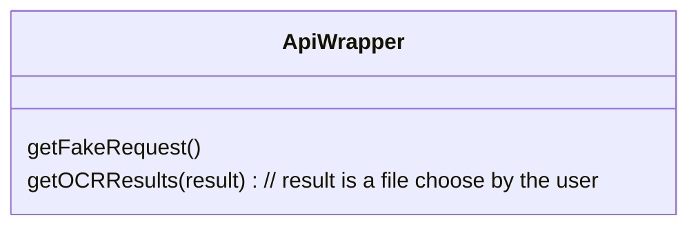
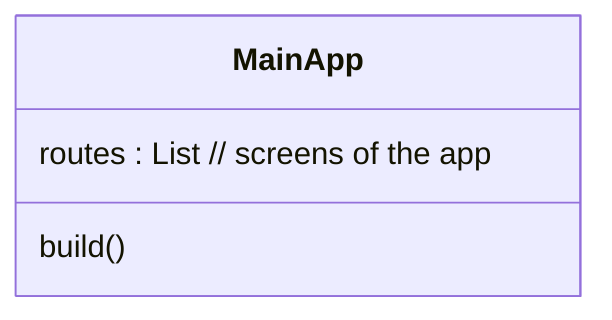
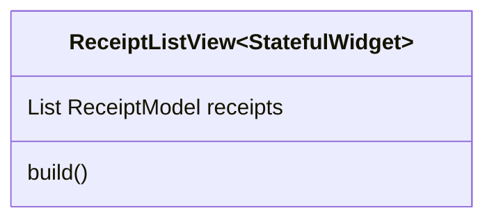
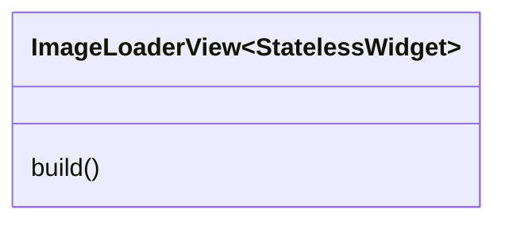
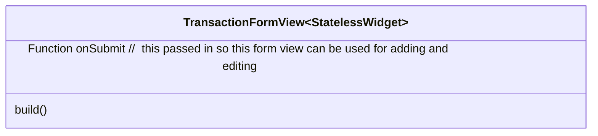
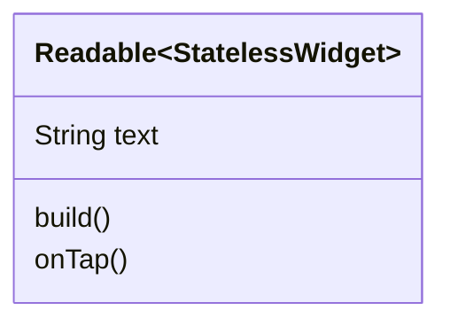

# Spending Tracker Client Version 2

[Demo Here](spendingtrackerv2.web.app)

### Supported Platforms
- MacOS -10.15 and above
- IOS - 9.0 and above
- Web
  - Runs in any web browser, and when mobile web users can download pwa to their device
  - Mobile and web users cna use their cameras to take pictures of receipts
- Windows and Linux
  - Flutter_tts does not suport windows and linux at this time


---

## Missing Features

- Saving and loading Receipps not working
- HistoryCharts not working 

---

## Introduction 

---
## Glossary 
1. Api (Application Programming Interface)
2. OCR 
3. Serialization
4. JSON
5. Requests
6. Responses 

---

### Functional Requirements
1. Users can store data about receipts on their device locally
2. Users can generate charts in the app and choose their own x and y parameters
3. Users can group transactions into multiple different categories
4. Any text can be tapped two twice to have its contents read out to the user 
5. Users can take images of receipts and the ocr will fill as many fields as it can

---

## System Architecture 

```mermaid
graph LR
Client --> Api Server --> OCRProcessor --> Server --> Client
```
- Multiple clients can be connected to one server at once 

---

## Complete System Overview 

### API Wrapper

### Application Overview

```mermaid
graph TD;
MainApp --> ReceiptListView --> ReceiptLocalStorage.get() 
MainApp --> ImageLoaderView --> ReceiptModel()
MainApp --> ReceiptFormView --> ReceiptModel.save()
MainApp --> ChartView --> ReceiptLocalStorage
```













### Sequence Diagrams


