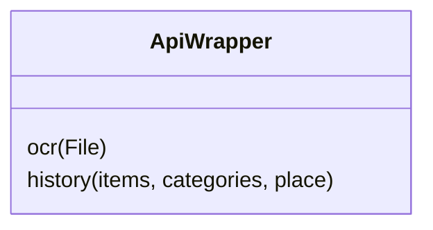
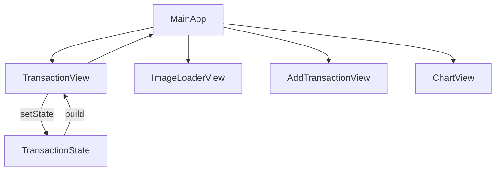
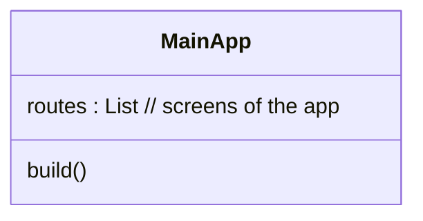
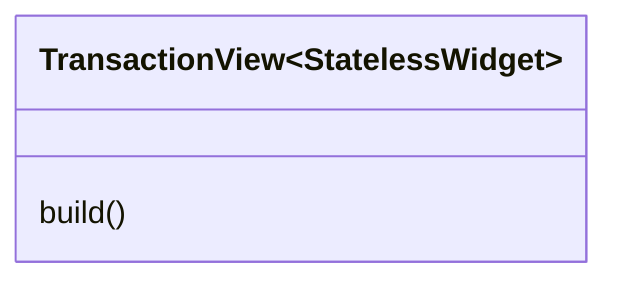
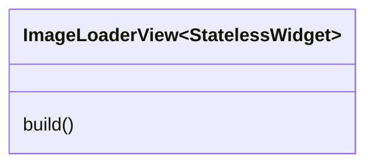
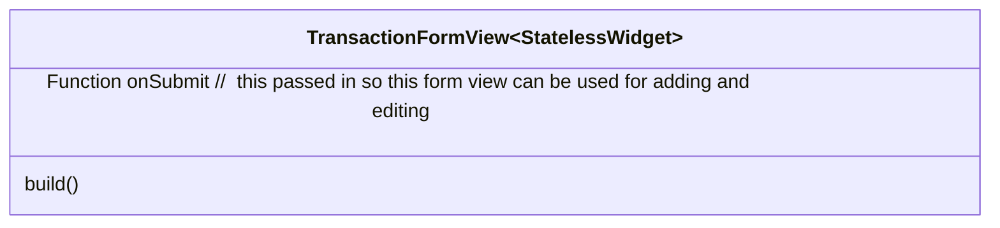
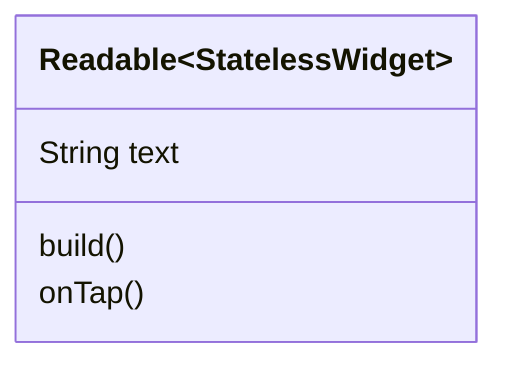

# Spending Tracker Client Version 2

[Demo Here](spendingtrackerv2.web.app)

### Supported Platforms
- MacOS -10.15 and above
- IOS - 9.0 and above
- Web
  - Runs in any web browser, and when mobile web users can download pwa to their device
  - Mobile and web users cna use their cameras to take pictures of receipts
- Windows and Linux
  - Flutter_tts does not suport windows and linux at this time


---

## Missing Features
- File upload to server not working 
- OCR not working
- HistoryCharts not working 

---

## Introduction 

---
## Glossary 
1. Api (Application Programming Interface)
2. OCR 
3. Screen Reader
4. Datasets
5. Web Scraping
6. Serialization
7. JSON
8. Requests
9. Responses 

---

### Functional Requirements
1. Users can zoom in and out of any part of the interface through standard zoom gestures
   1. Client must be running on a device with touch capacity
2. Users can generate charts in the app and export them to multiple file types 
3. Users can group transactions into multiple different categories
   1. Client must be connected to a copy of RESTApi
   2. Client must have values in the database
4. Any text can be tapped two twice to have its contents read out to the user 
   1. Client must be using a touch capable device 
   2. Client must be using a device with screen reader abilities
5. Users can take images of receipts and the ocr will fill as many fields as it can

---

## System Architecture 

```mermaid
graph LR
Client --> Api Server --> OCRProcessor --> Server --> Client
```
- Multiple clients can be connected to one server at once 

---

## Complete System Overview 

### API Wrapper

### Application Overview















### Sequence Diagrams


